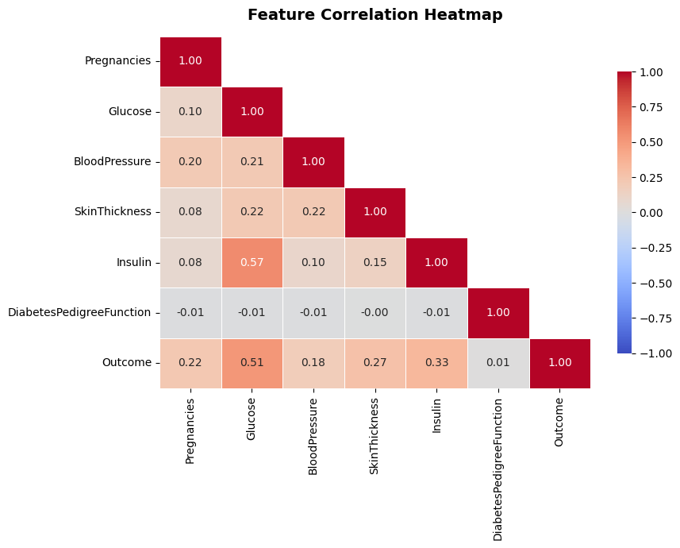
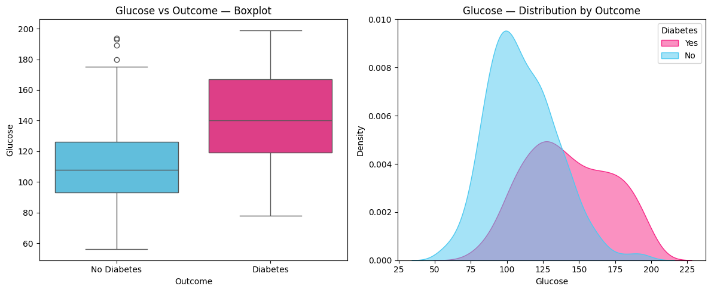
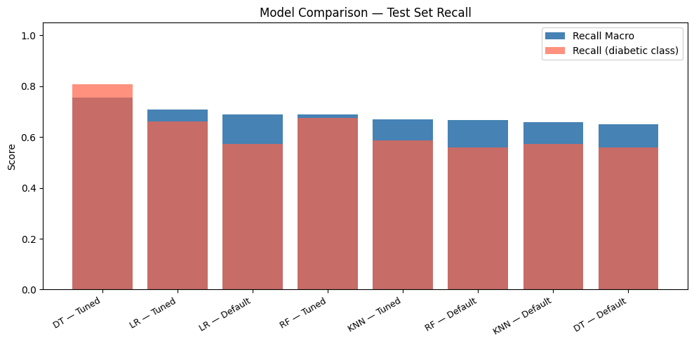
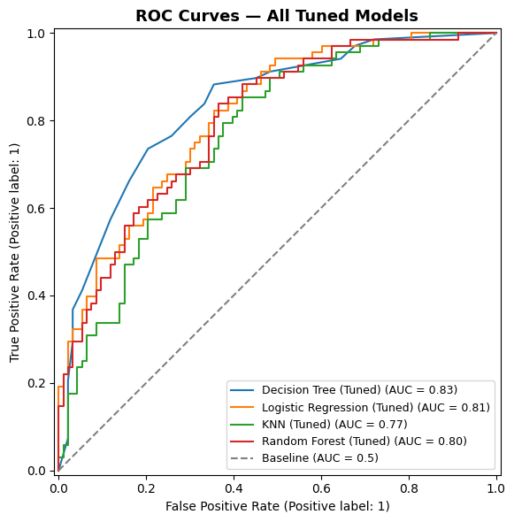
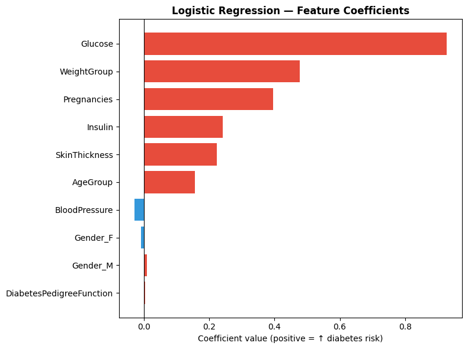
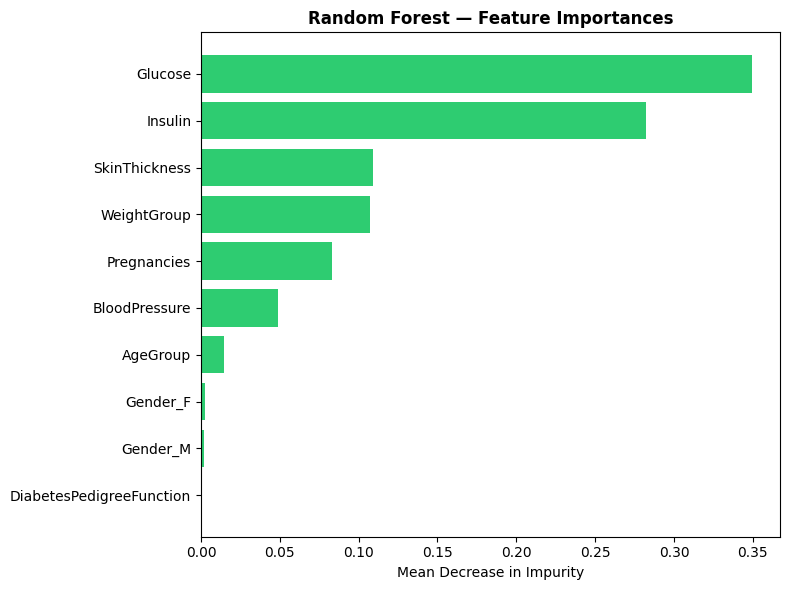
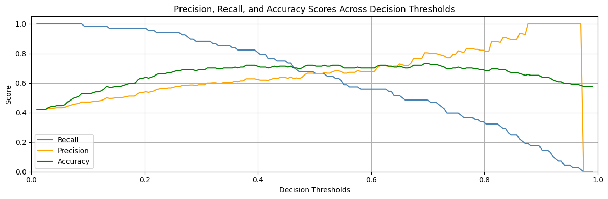

# Diabetes Prediction — End-to-End Machine Learning Pipeline

A complete ML classification project built on the **Pima Indians Diabetes dataset** (extended with demographic features). The project covers every stage from raw data cleaning through model deployment decisions: fixing dirty data, exploratory analysis, a leak-free preprocessing pipeline, training and tuning four classifiers, and selecting the final model with a clinical rationale.

---

## Table of Contents

- [Project Overview](#project-overview)
- [Dataset](#dataset)
- [Project Structure](#project-structure)
- [Data Cleaning](#data-cleaning)
- [Exploratory Data Analysis](#exploratory-data-analysis)
- [Preprocessing Pipeline](#preprocessing-pipeline)
- [Models & Tuning](#models--tuning)
- [Results](#results)
- [Final Model Selection](#final-model-selection)
- [Threshold Tuning](#threshold-tuning)
- [Limitations](#limitations)
- [Tech Stack](#tech-stack)
- [How to Run](#how-to-run)

---

## Project Overview

**Goal:** Predict whether a patient has diabetes using clinical and demographic features.

**Key design decisions:**
- Optimised for `recall_macro` — in medical screening, missing a diabetic patient is a more costly error than a false alarm.
- All preprocessing is wrapped in a `sklearn` Pipeline fitted only on training data — no data leakage.
- Four classifiers trained and tuned via `GridSearchCV`. Final model selected based on recall, AUC, interpretability, and calibration quality.

---

## Dataset

| Property | Value |
|---|---|
| Source | Pima Indians Diabetes (extended with demographic features) |
| Rows | 642 |
| Features | 10 (8 input features + 1 target) |
| Target | `Outcome` — 0 (no diabetes), 1 (diabetes) |
| Class split | ~65% no diabetes / ~35% diabetes |
| Numeric features | Glucose, BloodPressure, SkinThickness, Insulin, Pregnancies, DiabetesPedigreeFunction |
| Categorical features | Gender, AgeGroup, WeightGroup |

**Notable data quality issues found and fixed:**
- `Gender`: lowercase `'m'` typo corrected to `'M'`
- `AgeGroup`: invalid value `'<65'` converted to `NaN`
- `WeightGroup`: sentinel string `'MISSING'` converted to `NaN`; typo `'obsese_3'` corrected to `'obese_3'`
- `Pregnancies`: biologically impossible value of `1000` replaced with `NaN`
- `DiabetesPedigreeFunction`: stored as `object`, cast to `float64`

---

## Project Structure

```
Belt_Final__1_.ipynb     # Main notebook — all code, analysis, and results
README.md
images/                  # Export plots from the notebook to include here
  correlation_heatmap.png
  roc_curves.png
  model_comparison.png
  threshold_analysis.png
  lr_coefficients.png
  rf_importances.png
  glucose_vs_outcome.png
```

---

## Data Cleaning

The cleaning phase was methodical — inspecting dtypes, value counts, `.describe()` output, and missing value percentages before making any changes.

Missing value summary after cleaning:

| Feature | Missing % |
|---|---|
| Insulin | ~48.5% |
| SkinThickness | moderate |
| WeightGroup | low |
| AgeGroup | low |
| Pregnancies | single outlier |

The high missing rate in `Insulin` is a persistent limitation addressed through KNN imputation in the pipeline.

---

## Exploratory Data Analysis

### Feature Correlation



- **Glucose** has the strongest positive correlation with `Outcome` (0.51) — the clearest predictor.
- **Insulin** and **Pregnancies** show moderate correlation with the target.
- **BloodPressure** and **DiabetesPedigreeFunction** are nearly uncorrelated with `Outcome`.

### Glucose vs Outcome — Strongest Single Predictor



The separation between diabetic (pink) and non-diabetic (blue) patients is clearest on Glucose. The diabetic distribution is shifted significantly to the right, with very little overlap below ~100 mg/dL. This is consistent with Glucose being a defining diagnostic criterion for diabetes.

---

## Preprocessing Pipeline

A `ColumnTransformer` assembles three sub-pipelines, all fitted only on training data:

| Column type | Strategy | Reason |
|---|---|---|
| `AgeGroup`, `WeightGroup` | `SimpleImputer(most_frequent)` → `OrdinalEncoder` → `StandardScaler` | Natural order exists — preserving it helps tree-based models make better splits |
| `Gender` | `SimpleImputer(constant)` → `OneHotEncoder` | No order between categories |
| Numeric columns | `KNNImputer(n_neighbors=5)` → `StandardScaler` | KNN imputation leverages feature correlations — more accurate than global mean for skewed features like Insulin |

The train/test split is done **before** the pipeline is fit, using `stratify=y` to preserve class proportions.

---

## Models & Tuning

Four classifiers were trained in default and tuned versions — 8 models total.

**Tuning approach:** `GridSearchCV` with 5-fold cross-validation, scoring on `recall_macro`. Class weights (`'balanced'` or `'balanced_subsample'`) were included in all grids.

| Model | Tuning highlights |
|---|---|
| Decision Tree | `max_depth`, `min_samples_leaf`, `class_weight` |
| Logistic Regression | Solver/penalty combinations (`lbfgs`, `liblinear`, `saga` + `l1`, `l2`, `elasticnet`), `C` range `[0.0001, 1000]` |
| KNN | `n_neighbors` [3–31], `weights`, `metric` (Minkowski, cosine) |
| Random Forest | `n_estimators`, `max_depth`, `min_samples_leaf`, `max_features`, `class_weight` including `'balanced_subsample'` |

---

## Results

### Model Comparison — Test Set Recall



The **tuned Decision Tree** had the highest diabetic class recall on the test set (~0.81). The tuned Logistic Regression and Random Forest followed closely.

### Cross-Validation Scores (Recall Macro — 5-fold)

| Model | Best CV Score | Std |
|---|---|---|
| Logistic Regression | 74.87% | ±3.61% |
| KNN | 74.70% | ±3.86% |
| Random Forest | 74.50% | ±3.12% |
| Decision Tree | 73.17% | ±4.97% |

LR achieved the highest CV recall. Random Forest had the lowest variance — most consistent across folds.

### ROC Curves — All Tuned Models



| Model | AUC |
|---|---|
| Decision Tree (Tuned) | 0.83 |
| Logistic Regression (Tuned) | 0.81 |
| Random Forest (Tuned) | 0.80 |
| KNN (Tuned) | 0.77 |

All models outperformed the random baseline (AUC = 0.5) by a wide margin. The Decision Tree's AUC lead on the test set narrows when accounting for CV variance — it also had the highest fold-to-fold instability (±4.97%).

---

## Final Model Selection

**Selected: Tuned Logistic Regression**

The Decision Tree had the highest AUC on the single test split (0.83), but its CV recall was the lowest of all four models (73.17%) with the highest fold-to-fold variance (±4.97%). On a dataset of 642 rows, a single test-set result can be lucky. The CV distribution is a more honest estimate of real-world performance — and by that measure, LR wins.

| Reason | Detail |
|---|---|
| Best CV recall_macro | 74.87% — highest average across 5 folds |
| Most stable | Lower variance than DT across CV folds |
| Interpretable | Coefficients readable by clinicians |
| Calibrated probabilities | `predict_proba` supports threshold tuning |
| Less overfitting risk | Regularised; more reliable on n=642 than deep ensembles |
| Competitive AUC | 0.81 on test set |

### Feature Coefficients — Logistic Regression



Glucose dominates by a large margin. WeightGroup and Pregnancies follow. BloodPressure has a slight negative coefficient — a weak and possibly confounded predictor. DiabetesPedigreeFunction contributes almost nothing in this model.

### Feature Importances — Random Forest



Random Forest ranks Glucose first (~0.34 mean decrease in impurity) and Insulin second (~0.28) — notably higher than in LR, reflecting how RF exploits non-linear Glucose/Insulin interactions. Both models agree Glucose is the dominant predictor. Gender and DiabetesPedigreeFunction contribute near zero.

---

## Threshold Tuning



The default classification threshold is 0.5. For medical screening, lowering it to **0.35–0.40** is preferable:

- Recall (catching diabetic patients) stays high
- Accuracy peaks in the 0.35–0.55 range
- Precision drops modestly — more false alarms, but fewer missed diagnoses

Missing a diabetic patient is the costlier error: the disease progresses untreated. A follow-up test resolves a false alarm cheaply.

---

## Limitations

| Limitation | Impact |
|---|---|
| Small dataset (n=642) | CV variance is high (~±0.03). Results need validation on a larger cohort before clinical use. |
| Insulin ~48% missing | KNN imputation recovers correlation-based estimates, but cannot replace data that was never collected. Insulin's predictive contribution is suppressed. |
| Population-specific | All patients are Pima Indian women aged ≥ 21. Model will not generalise to other populations, genders, or age groups without retraining. |
| Class imbalance (65/35) | Mild — handled with `class_weight='balanced'`. Should be monitored on future data. |

---

## Tech Stack

- Python 3
- pandas, numpy
- scikit-learn (Pipeline, ColumnTransformer, GridSearchCV, KNNImputer)
- matplotlib, seaborn
- Google Colab

---

## How to Run

1. Open `Belt_Final__1_.ipynb` in Google Colab or Jupyter.
2. Mount Google Drive and update the dataset path in **Section 3** to point to your copy of `Belt2_B_diabetes_v2_final.csv`.
3. Run all cells in order. Preprocessing, training, and evaluation are fully reproducible with `random_state=42`.

---

*Dataset: Pima Indians Diabetes — 642 rows, 10 features, 35% positive class rate*
